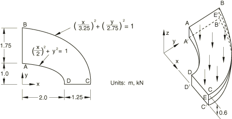

# Thick plate under pressure

## Material
Linear elastic material model:
- Young's modulus: 2.1e11 Pa
- Poisson's ratio: 0.3
## Boundary conditions
- Y-symmetry condition on CD
- X-symmetry condition on AB
- Ux, Uy = 0 on BC
- Uz = 0 on EE
## Loading
- normal pressure of 1.0e6 Pa
## Benchmark purpose
The purpose of the benchmark is to check if $\sigma_{yy}=5.38e6 Pa$ at point D

