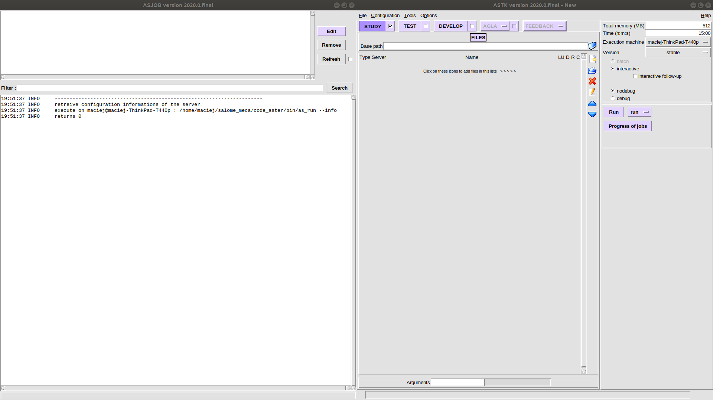
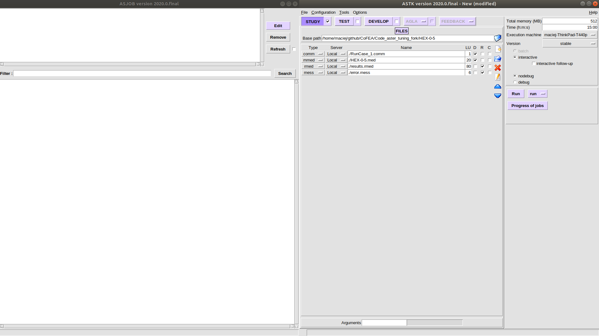

# Code_aster Compilation
To use Code_aster in multithreading mode on UBUNTU 18.04 it is needed to compile from source. In order to do so it is necessary to install required dependencies tools. The source code of Code_aster can be obtained from this repository or https://www.code-aster.org/spip.php?rubrique21

# Prerequisities
1. Install the required tools for Code_aster:
      - gcc, g++, gfortran,
      - cmake,
      - python3,
      - python3-dev,
      - python3-numpy,
      - tk,
      - bison,,
      - flex,
      - liblapack-dev, libblas-dev ou libopenblas-dev,
      - libboost-python-dev (+ libboost-numpy-dev on ubuntu, boost-devel on centos),
      - zlib (named zlib1g-dev sur debian/ubuntu).

using your package manager. For Ubuntu and Debian-oriented system the command should be like:

``` example
sudo apt-get install gfortran
```
# Compilation

In order to compile Code_aster please download the source code to the installation directory.

```example
wget https://www.code-aster.org/FICHIERS/aster-full-src-14.6.0-1.noarch.tar.gz
```

After downloading the file, please unpack it using the following commands:

```example
gunzip aster-full-src-14.6.0-1.noarch.tar.gz
tar -xvf aster-full-src-14.6.0-1.noarch.tar
```
To compile the code. please use command:

```example
python3 setup.py install --prefix=/your/installation/path/to/code/aster
```
To be able to use Code_aster and ASTK in every directory on your system you need to add line to .bashrc file

```example
cd
source /your/installation/path/to/code/aster/etc/codeaster/profile.sh > .bashrc
source .bashrc
```
Sometimes this operation need root privileges so add sudo at the beginnings of the commands.

# How to use ASTK with Code_aster

Change your directory to the simulation directory. In this directory there should be solver input file (*.comm) and mesh file  Create two dummy files result.rmed (there will be the results of the simulation) and error.mess (logfile of the solver). Use touch command:

```example
touch result.rmed
touch error.mess
```

 Type the

```example
astk
```
in the terminal. The ASTK Window should appear with the job progress window.
[
](png)

In the Base path select your working directory, then add *.comm file, mesh file, *.rmed and *.mess to run the simulation with the blue, open folder icon.
[
](png)
Happy meshing!
