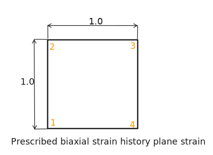

  The readme file should be amend to present benchmark information:
  
  Benchmark description: [link](http://wufengyun.com:888/v6.14/books/bmk/default.htm?startat=ch04s06anf38.html)

  # Model sketch
  
  # Benchmark purpose
  describe what the benchmark is trying to measure
  # Material
  write down material data
  # Boundary conditions and loads
  describe boundary conditions and loads
  # Mesh
  describe topology of mesh used in the study
  # Results
  provide benchmark results for tested codes
