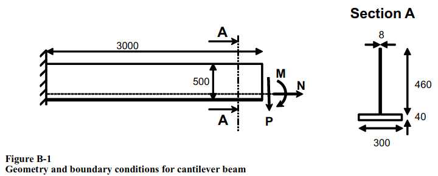
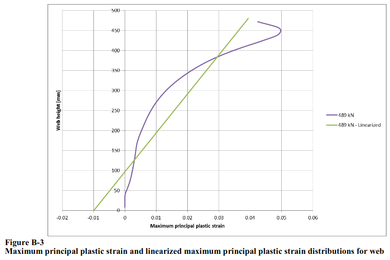

  The readme file should be amend to present benchmark information:

# Model sketch
The geometry consists of one cantilever prismatic T-beam.
Set a picture:

(Source of the picture - [1])

# Benchmark purpose
Chief point is comparison of plastic strain through height of section with data given in standard [1].

(Source of the picture - [1])

{calculate center of cross section inertia center}

# Material
Beam plates are modeled as plastic S355 acc. to [1] s.4.7.5.

{set figure of vertical and horizontal material plasticity profile}

# Boundary conditions and loads
N = 489 kN  
P = -0.15 * N   
M = -0.45 * N  it's some ambiguity because units are inconsistent}

{describe kinematic releation between boundary edges and relative point in the center of inertia}

# Mesh
Mesh is created approximately with mesh size 16mmx16mm.
Mesh consists of 2 order shell elements with  additional node inside.
Mesh is regular.

  describe topology of mesh used in the study
# Results
Provide some maps + comparing plot of plasticity profile
  provide benchmark results for tested codes

# Bibliography
[1] - https://rules.dnv.com/docs/pdf/DNVPM/codes/docs/2013-06/RP-C208.pdf
