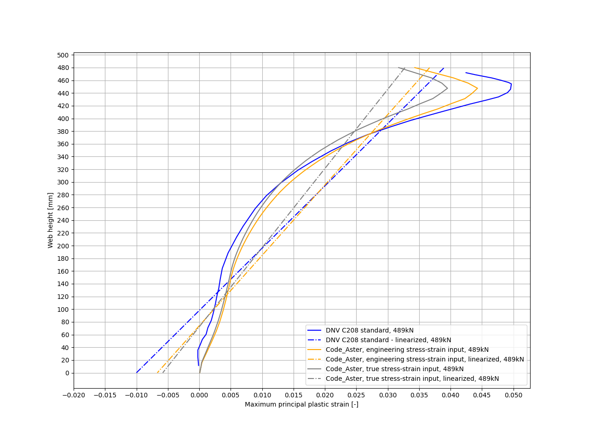

### Folder contents
- 'readme_images' - pictures used in this doc
- 'auxiliaries' - extra helping scripts (hands-on assessments, figures generators, pictures)
- 'results' - pictures and .csvs from fea analyses
- 'model_setup_CA' - model setup for CodeAster solver

# Model sketch

#### Essential dimensions
The geometry consists of one cantilever prismatic T-beam.
Set a picture:

(Source of the picture - [1])

#### Centroid assessment
Model description in [1] lacks of height of center of section.
Coordinates of center of area shall be calculated based on first moments of rectangles.

Subscript 'v' stands for 'vertical plate' - flange  
Subscript 'h' stands for 'horizontal plate' - web

Cross section areas:  
Av = 8 mm * 460 mm = 3680 mm2   
Ah = 40 mm * 300 mm = 12000 mm2

First moment of areas acc. to gravity center of horizontal plate:  
Sv = Av * (460/2 + 40/2) = 920e3 mm3      
Sh = 0 mm3

Centroid of cross section area is yc above symmetry line of vertical plate:  
yc = (Sv + Sh) / (Av + Ah) = 920e3 mm3 / 15680 mm2 = 58.67 mm

# Benchmark purpose
Chief point is comparison of plastic strain through height of section with data given in standard [1].

(Source of the picture - [1])

Plastic strain benchmark curve was digitized with [2]. Digitized .xml is put in model_setup path.  

# Material
Beam plates are modeled as plastic S355 acc. to [1] s.4.7.5. using true stress strain.
Vertical and horizontal plates have relevantly various thicknesses, what shall be taken into account.  
Material is ideally plastic in range above material tensile strength.
  

Values to implement in material definition for 16mm thickness S355:  
strain 	 stress  
0.0000 	 0  
0.0015 	 320  
0.0055 	 357  
0.0212 	 366  
0.1406 	 541  
0.2797 	 541  

Values to implement in material definition for 16-40 mm thickness S355:  
strain 	 stress  
0.0000 	 0  
0.0015 	 311  
0.0055 	 346.9  
0.0212 	 355.9  
0.1406 	 541.6  
0.2797 	 541.6  

# Boundary conditions and loads
Nx = 500 kN  
P = -0.15 * Nx   
M = -0.45 * Nx * 1m  

On 'restraint' group of nodes lack of displacement in each direction is imposed.
On 'force' group of nodes are imposed loads N, P, M indirectly by point cross section centroid - additional kinematic relations are necessary.
  

Geometrical nonlinearity shall be taken into account, because significant angles of rotation are presumed.

###### Note about boundaries used with Code_Aster
Load was imposed simultaneously increasingly by 5% on each step. It means that results for the last two steps reflect Nx = 475 kN and Nx = 500 kN.

# Mesh
Mesh is created approximately with mesh size 16mmx16mm.
Original example described in [1] uses I order elements.

Mesh contains also auxiliary point named 'aux_point' - point indirectly through MPC exerts moment and forces into 'force' group of nodes.

  

###### Note about mesh used with Code_Aster
Mesh comprises of 2 order shell elements with  additional node inside. Other types of shell elements are unavailable to use with geometrical and material nonlinearities.

# Results
Values of first principal plastic strain were extracted across line between points (40.3226, 480.0, 0.0) and (40.3226, 0.0, 0.0).

  

###### Note about results extracted with Code_Aster
Values of plastic strains from middle layer were extracted.
Values averaged by elements were extracted.

Maximum plastic strains for 475 kN:
  

Maximum plastic strains for 500 kN:
  

### Run model in Code_Aster in a few steps:  
1. Run B_1_1_cantilever_beam.py in python to generate mesh - med by default.
2. Change paths in *.astk files to your own, and also optionally change 'current_path' variable in B_1_1_cantilever_beam_calculation.comm
3. Run B_1_1_cantilever_beam_calculation.astk
4. Replace into True requested output field
5. Run B_1_1_cantilever_beam_postpro.astk

### Bibliography
[1] - https://rules.dnv.com/docs/pdf/DNVPM/codes/docs/2013-06/RP-C208.pdf  
[2] - http://plotdigitizer.sourceforge.net/
