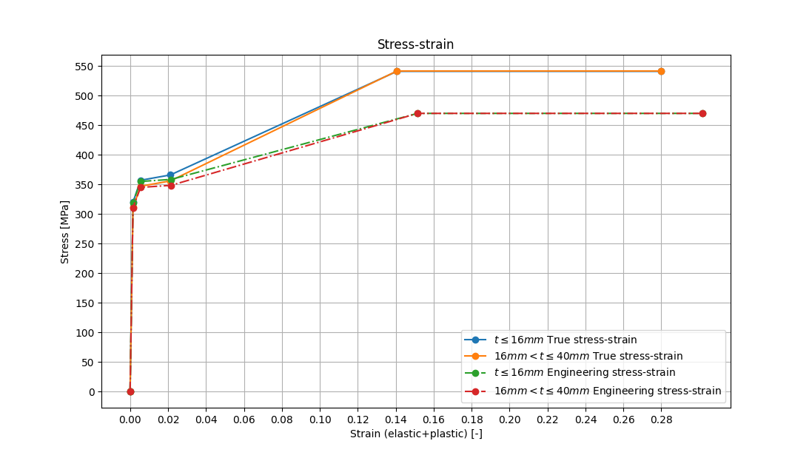

# Model sketch

#### Essential dimensions
The geometry consists of one cantilever prismatic T-beam.
Set a picture:

(Source of the picture - [1])

#### Centroid assessment
Model description in [1] lacks of height of center of section.
Coordinates of center of area shall be calculated based od on first moments of rectangles.

Subscript 'v' stands for 'vertical plate'
Subscript 'h' stands for 'horizontal plate'

Cross section areas:  
Av = 8 mm * 460 mm = 3680 mm2   
Ah = 40 mm * 300 mm = 12000 mm2

First moment of areas acc. to gravity center of horizontal plate:  
Sv = Av * (460/2 + 40/2) = 920e3 mm3      
Sh = 0 mm3

Centroid of cross section area is yc above symmetry line of vertical plate:  
yc = (Sv + Sh) / (Av + Ah) = 920e3 mm3 / 15680 mm2 = 58.67 mm

# Benchmark purpose
Chief point is comparison of plastic strain through height of section with data given in standard [1].

(Source of the picture - [1])

Plastic strain benchmark curve was digitized with [2]. Digitized .xml is put in model_setup path.  

# Material
Beam plates are modeled as plastic S355 acc. to [1] s.4.7.5.
Vertical and horizontal plates have relevantly various thicknesses, what shall be taken into account.  
Material is ideally plastic in range above material tensile strength.
  

In the benchmark description is ambiguity about exact type of material used. Chapter 4.7.5 treats as engineering as true stress-strain curves. Both of them provide comparable results (checking influence might be subject of extension this example)

Values to implement in material definition for 16mm thickness S355:  
strain 	 strain  
0.0000 	 0  
0.0015 	 319.5  
0.0055 	 355  
0.0215 	 358.4  
0.1515 	 470.0  
0.3015 	 470.0  

Values to implement in material definition for 16-40 mm   thickness S355:  
strain 	 strain  
0.0000 	 0  
0.0015 	 310.5  
0.0055 	 345  
0.0215 	 348.4  
0.1515 	 470.0  
0.3015 	 470.0  
{now I lost my certainty about implementaion of nonlinear material in C_A - i hope someone might check it}

# Boundary conditions and loads
N = 489 kN  
P = -0.15 * N   
M = -0.45 * N  {it's some ambiguity because units are inconsistent-this might be possible source of discrepancy}

On 'restraint' group of nodes is imposed lack of displacement in each direction.
On 'force' group of nodes are imposed loads N,P,M indirectly by from cross section centroid - additional kinematic relations are necessary.
  

Geometrical nonlinearity shall be taken into account, because significant angles of rotation are presumed.

# Mesh
Mesh is created approximately with mesh size 16mmx16mm.
Mesh consists of 2 order shell elements with  additional node inside.
Mesh is regular with approximate size of element 16mm.  
Mesh contains also auxiliary point named 'aux_point' - points directly exerts moment and forces to 'force' group of nodes.

  

Original example in standard uses I order elements, but Code_Aster demands II order to use with nonlinear materials.

# Results
Provide some maps + comparing plot of plasticity profile
  provide benchmark results for tested codes
{You can find current nonsatisfying results in results folder}

### Run model in Code_Aster in a few steps:  
1. Run B_1_1_cantilever_beam.py in python to generate mesh - med by default.
2. Change paths in *.astk files to your own, and also optionally change 'current_path' variable in B_1_1_cantilever_beam_calculation.comm
3. Run B_1_1_cantilever_beam_calculation.astk
4. Run B_1_1_cantilever_beam_postpro.astk with replaced

### Bibliography
[1] - https://rules.dnv.com/docs/pdf/DNVPM/codes/docs/2013-06/RP-C208.pdf  
[2] - http://plotdigitizer.sourceforge.net/
